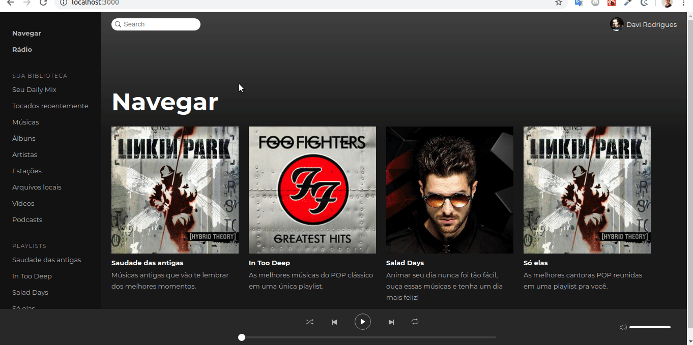

# Spotify Clone

This project was developed using reactjs, redux/saga and styled components. Is the spotify clone for listing playlists and your songs.

## Prerequisites

Node 8.10.0 or later on your local development machine

## Installing

* After that you should clone this repository on your machine with the `git clone https://github.com/davir8/spotify-clone`;
* Go to the project directory with the `cd spotify-clone` command;
* After that install the project dependencies using `npm install` or` yarn install`;
* Then run `npx json-server server.json --port 3001` command for start the backend api;
* Now run the project using `npm start` or `yarn start`;

if all went well, the project will be available at: http://localhost:3000/ `

## Functionalities

* List of playlists
* List of songs
* Play/pause a song
* Next/previous song

## License

This project is licensed under the MIT License - see the [LICENSE.md](LICENSE) file for details
